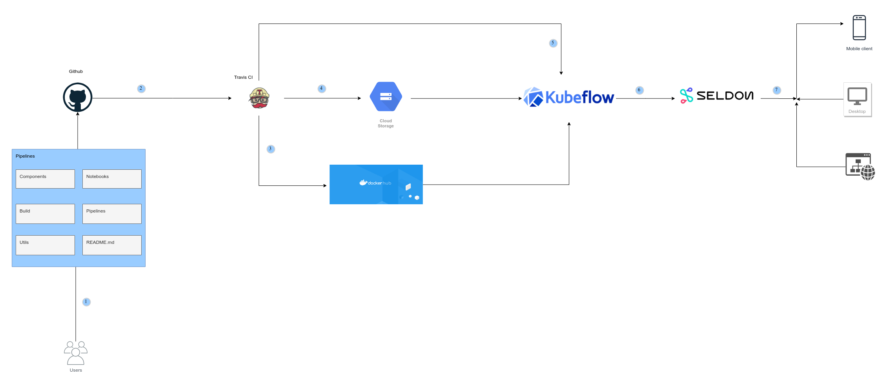

# MLOps on kubeflow

- This repo demonstrates an end-end pipeline for production machine learning workflows on kubeflow
- This example seeks to :
  1. Demonstrate how to build ML workflows on kubernetes using kubeflow pipelines
  2. Demonstrate how to setup CI/CD workflows for machine learning on kubeflow
  3. Run distributed training jobs on kubernetes using TF job
  4. Deploy, operationalize and monitor ML models at scale on kubernetes

## 1. Setting up kubeflow

Check out the official [documentation](https://www.kubeflow.org/docs/started/getting-started/) on how to setup kubeflow on a kubernetes cluster

## 2. ML workflow

